# Product Requirements Document (PRD)
## Flight Search Engine - SkyScanner Pro

**Version:** 1.0  
**Author:** Abdul Arham  
**Date:** January 16, 2026  
**Status:** Draft

---

## 1. Executive Summary

SkyScanner Pro is a modern, responsive flight search engine that empowers travelers to discover, compare, and analyze flight options with real-time visual insights. Built with a focus on performance and user experience, it provides instant filtering capabilities with synchronized data visualization.

---

## 2. Problem Statement

### The Challenge
Travelers today face information overload when searching for flights. Existing solutions often suffer from:
- **Slow filter updates** that require page reloads
- **Disconnected data views** where filters don't sync with visual analytics
- **Poor mobile experiences** on responsive breakpoints
- **Lack of visual price trend analysis** to aid decision-making

### Our Solution
A lightning-fast flight search interface where every filter action instantly updates both the results list AND a live price visualization graph—enabling users to make data-driven booking decisions in seconds, not minutes.

---

## 3. Goals & Success Metrics

### Primary Goals
| Goal | Description | Priority |
|------|-------------|----------|
| **Real-time Sync** | Filter changes update list + graph simultaneously | P0 |
| **Sub-200ms Updates** | Client-side filtering completes in <200ms | P0 |
| **Mobile-First Design** | Fully responsive across all breakpoints | P0 |
| **Visual Price Analysis** | Interactive Recharts graph with hover tooltips | P1 |

### Success Metrics (KPIs)
| Metric | Target | Measurement Method |
|--------|--------|-------------------|
| Filter Latency | < 200ms | Performance.now() logging |
| Time to Interactive (TTI) | < 3s | Lighthouse audit |
| Mobile Usability Score | > 95 | Lighthouse audit |
| API Response Cache Hit Rate | > 80% | TanStack Query DevTools |

### Non-Goals (Out of Scope v1.0)
- ❌ Actual flight booking/payment processing
- ❌ User accounts and saved searches
- ❌ Multi-city or complex itinerary planning
- ❌ Price alerts and notifications
- ❌ Integration with multiple flight APIs (Amadeus only)

---

## 4. User Personas

### Primary Persona: "The Smart Traveler"
- **Demographics:** 25-45, tech-savvy, price-conscious
- **Behavior:** Compares multiple options, values transparency
- **Pain Points:** Frustrated by slow loading, hidden fees
- **Goals:** Find the best value flight quickly

### Secondary Persona: "The Business Booker"
- **Demographics:** 30-55, time-constrained
- **Behavior:** Prioritizes schedule over price
- **Pain Points:** Needs to filter by specific airlines/times
- **Goals:** Book efficiently with minimal clicks

---

## 5. User Flow

```mermaid
flowchart TD
    A[🏠 Landing Page] --> B[🔍 Enter Search Criteria]
    B --> C{Valid Input?}
    C -->|No| D[Show Validation Error]
    D --> B
    C -->|Yes| E[Fetch Flights from Amadeus API]
    E --> F[Display Results + Price Graph]
    F --> G[Apply Filters]
    G --> H[Instant Update: List + Graph]
    H --> G
    H --> I[Hover Graph for Details]
    I --> J[Select Flight]
    J --> K[View Flight Details]
    K --> L[🎉 Booking CTA - External Link]
```

### Detailed User Journey
1. **Search Phase**
   - User lands on the search page
   - Selects origin/destination airports (with autocomplete)
   - Chooses departure date (and optional return)
   - Clicks "Search Flights"

2. **Discovery Phase**
   - Results load with skeleton UI
   - Price graph renders showing distribution
   - Flight cards display with key info

3. **Analysis Phase**
   - User applies filters (stops, price range, airline)
   - List AND graph update instantly (<200ms)
   - User hovers over graph points for tooltips

4. **Selection Phase**
   - User identifies best option
   - Clicks for expanded details
   - Proceeds to booking (external redirect)

---

## 6. Feature Requirements

### 6.1 Search Form
| Feature | Requirement | Priority |
|---------|-------------|----------|
| Origin Input | Autocomplete with airport codes/names | P0 |
| Destination Input | Autocomplete with airport codes/names | P0 |
| Date Picker | Calendar UI, min date = today | P0 |
| Passenger Count | Dropdown (1-9 passengers) | P1 |
| Trip Type | One-way / Round-trip toggle | P1 |

### 6.2 Filter Sidebar
| Feature | Requirement | Priority |
|---------|-------------|----------|
| Stops Filter | Checkboxes: Non-stop, 1 stop, 2+ stops | P0 |
| Price Range | Dual-handle slider with min/max | P0 |
| Airline Filter | Multi-select checkboxes | P0 |
| Departure Time | Time range picker (Morning/Afternoon/Evening) | P1 |

### 6.3 Price Graph (Recharts)
| Feature | Requirement | Priority |
|---------|-------------|----------|
| Chart Type | Bar or Area chart | P0 |
| X-Axis | Airlines or Price buckets | P0 |
| Y-Axis | Price in USD | P0 |
| Interactivity | Hover tooltips with details | P0 |
| Responsiveness | Adapts to container width | P0 |
| Sync with Filters | Re-renders on every filter change | P0 |

### 6.4 Flight Cards
| Feature | Requirement | Priority |
|---------|-------------|----------|
| Airline Logo | Display carrier icon | P1 |
| Price Display | Prominent, formatted currency | P0 |
| Duration | Total flight time | P0 |
| Stops Indicator | Visual stop count badge | P0 |
| Times | Departure/Arrival in local time | P0 |
| Best Value Badge | Highlight cheapest option | P1 |

---

## 7. Technical Constraints

### API Limitations (Amadeus Test Environment)
- Rate limit: ~10 requests/second
- Test data only (not real-time prices)
- OAuth2 token expires every 30 minutes

### Performance Budgets
- Initial JS bundle: < 200KB gzipped
- Time to First Contentful Paint: < 1.5s
- Filter update render: < 200ms

---

## 8. Design Principles

1. **Speed is a Feature:** Every interaction must feel instant
2. **Data Visualization First:** The graph is not decoration—it's a decision tool
3. **Progressive Disclosure:** Show essential info first, details on demand
4. **Accessibility:** WCAG 2.1 AA compliance minimum

---

## 9. Open Questions

| Question | Status | Owner |
|----------|--------|-------|
| Should we cache API results in localStorage? | Open | Engineering |
| Include return flight search in v1? | Decided: Yes | Product |
| Dark mode support? | Nice to have | Design |

---

## 10. Appendix

### Competitive Analysis
| Feature | Google Flights | Kayak | SkyScanner Pro |
|---------|---------------|-------|----------------|
| Real-time Graph Sync | ❌ | ❌ | ✅ |
| Filter Speed | Fast | Medium | Instant |
| Mobile UX | Excellent | Good | Excellent |
| Price Visualization | Calendar | List | Interactive Graph |

### References
- [Amadeus Self-Service API Docs](https://developers.amadeus.com/)
- [Recharts Documentation](https://recharts.org/)
- [TanStack Query Docs](https://tanstack.com/query)
