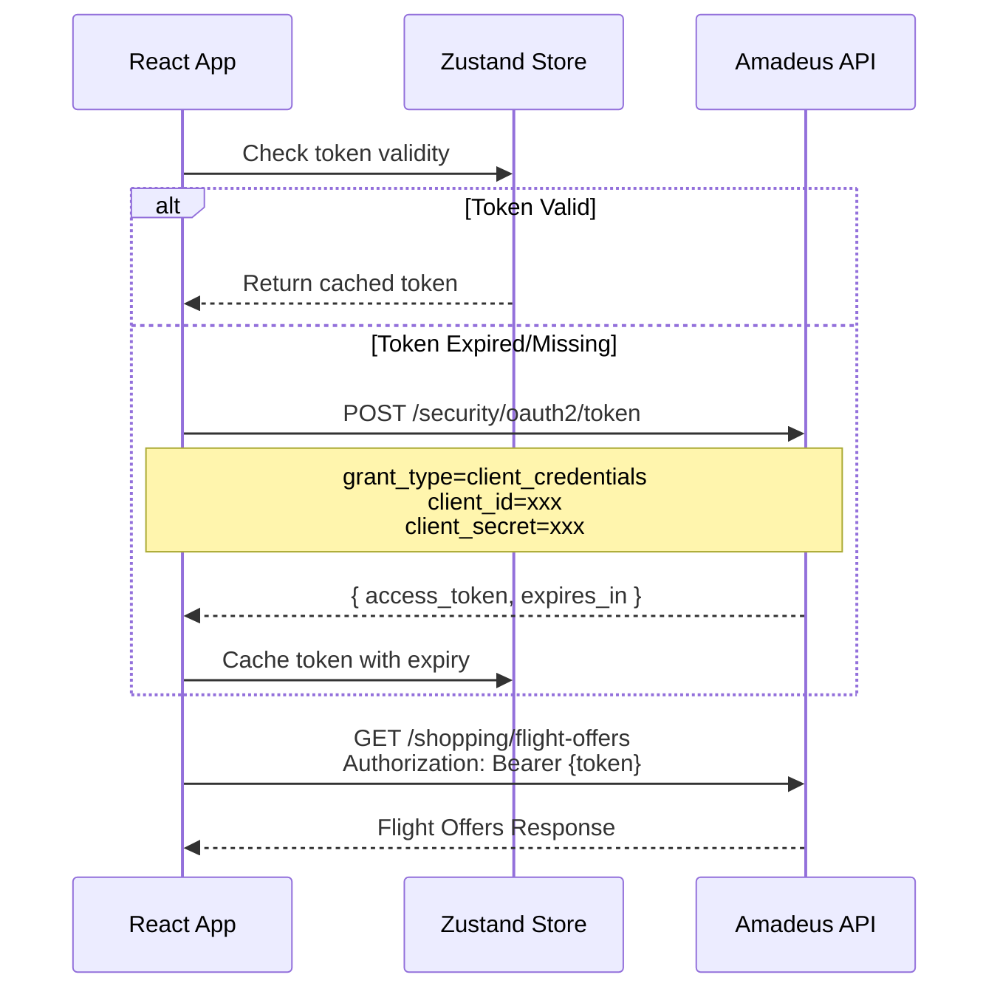

# Software Requirements Specification (SRS)
## Flight Search Engine - SkyScanner Pro

**Version:** 1.0  
**Author:** Abdul Arham  
**Date:** January 16, 2026  

---

## 1. Introduction

### 1.1 Purpose
This document specifies the functional and non-functional requirements for the SkyScanner Pro Flight Search Engine web application. It serves as a technical contract between product requirements and engineering implementation.

### 1.2 Scope
The system provides a single-page application (SPA) for searching, filtering, and visualizing flight options using the Amadeus Self-Service API. The application is client-side rendered with React and communicates with the Amadeus API for flight data.

### 1.3 Technology Stack
| Layer | Technology |
|-------|------------|
| Framework | React 18+ with Vite |
| Language | TypeScript 5.x |
| Styling | Tailwind CSS + ShadcnUI |
| State Management | Zustand |
| Data Fetching | Axios + TanStack Query v5 |
| Charting | Recharts |
| Build Tool | Vite |

---

## 2. Functional Requirements

### 2.1 Flight Search (FR-001)

#### 2.1.1 Search Form Inputs
| Field | Type | Validation | Required |
|-------|------|------------|----------|
| Origin | Autocomplete Text | Valid IATA code (3 letters) | Yes |
| Destination | Autocomplete Text | Valid IATA code (3 letters) | Yes |
| Departure Date | Date Picker | Must be ≥ today | Yes |
| Return Date | Date Picker | Must be ≥ departure date | No (One-way) |
| Passengers | Number Dropdown | Range: 1-9 | Yes (default: 1) |
| Trip Type | Radio/Toggle | "One-way" or "Round-trip" | Yes (default: Round-trip) |

#### 2.1.2 Autocomplete Behavior
```
INPUT: User types "New"
OUTPUT: 
  - JFK - John F. Kennedy International (New York)
  - LGA - LaGuardia Airport (New York)
  - EWR - Newark Liberty International (Newark)
TRIGGER: After 2 characters typed
DEBOUNCE: 300ms
```

#### 2.1.3 Search Execution
- **Trigger:** User clicks "Search Flights" button
- **Pre-condition:** All required fields valid
- **Action:** API call to Amadeus Flight Offers Search
- **Success:** Store results in Zustand, render list + graph
- **Failure:** Display error toast with retry option

---

### 2.2 Filter System (FR-002)

#### 2.2.1 Available Filters
| Filter | UI Component | Values | Default |
|--------|--------------|--------|---------|
| Stops | Checkbox Group | Non-stop, 1 stop, 2+ stops | All checked |
| Price Range | Dual Range Slider | Min: $0, Max: dynamic | Full range |
| Airlines | Checkbox List | Dynamic from results | All checked |
| Departure Time | Segment Buttons | Morning (6-12), Afternoon (12-18), Evening (18-24), Night (0-6) | All selected |

#### 2.2.2 Filter Logic
```typescript
// Pseudo-code for filter application
const applyFilters = (flights: Flight[], filters: Filters): Flight[] => {
  return flights.filter(flight => {
    const matchesStops = filters.stops.includes(flight.stopCount);
    const matchesPrice = flight.price >= filters.priceRange[0] 
                      && flight.price <= filters.priceRange[1];
    const matchesAirline = filters.airlines.includes(flight.carrierCode);
    const matchesTime = filters.departureTimes.some(
      timeSlot => isInTimeSlot(flight.departureTime, timeSlot)
    );
    return matchesStops && matchesPrice && matchesAirline && matchesTime;
  });
};
```

#### 2.2.3 Filter Performance Requirement
- **Constraint:** Filter application MUST complete in < 200ms
- **Method:** Client-side filtering with memoization
- **Measurement:** `performance.now()` delta logging in development

---

### 2.3 Price Visualization Graph (FR-003)

#### 2.3.1 Graph Specifications
| Property | Value |
|----------|-------|
| Library | Recharts |
| Chart Type | BarChart (primary) or AreaChart |
| X-Axis | Airline names OR Price buckets |
| Y-Axis | Price (USD) |
| Responsive | Yes, fills container width |

#### 2.3.2 Data Transformation
```typescript
// Transform flight data for chart
interface ChartDataPoint {
  name: string;        // Airline name or price bucket
  price: number;       // Average or minimum price
  count: number;       // Number of flights in bucket
}

const transformForChart = (flights: Flight[]): ChartDataPoint[] => {
  const grouped = groupBy(flights, 'carrierName');
  return Object.entries(grouped).map(([name, group]) => ({
    name,
    price: Math.min(...group.map(f => f.price)),
    count: group.length
  }));
};
```

#### 2.3.3 Interactivity Requirements
- **Hover:** Display tooltip with airline, price, and flight count
- **Click:** Filter results to only that airline
- **Animation:** Smooth 300ms transitions on data changes

---

### 2.4 Flight Results Display (FR-004)

#### 2.4.1 Flight Card Data
| Field | Source | Format |
|-------|--------|--------|
| Airline Name | `dictionaries.carriers[carrierCode]` | String |
| Price | `price.grandTotal` | Currency (USD) |
| Duration | `itineraries[0].duration` | "Xh Ym" |
| Stops | `segments.length - 1` | "Non-stop" / "1 stop" / "2 stops" |
| Departure | `segments[0].departure.at` | "HH:MM AM/PM" |
| Arrival | `segments[last].arrival.at` | "HH:MM AM/PM" |
| Airports | `segments[0].departure.iataCode → segments[last].arrival.iataCode` | "JFK → LAX" |

#### 2.4.2 Sorting Options
| Option | Logic |
|--------|-------|
| Price (Low to High) | Ascending by `price.grandTotal` |
| Duration (Shortest) | Ascending by total minutes |
| Departure (Earliest) | Ascending by departure time |

#### 2.4.3 Best Value Badge
- **Condition:** Flight with lowest `price.grandTotal` in filtered results
- **Display:** Green badge with "Best Value" text
- **Update:** Re-calculated on every filter change

---

## 3. Non-Functional Requirements

### 3.1 Performance (NFR-001)
| Metric | Target | Priority |
|--------|--------|----------|
| Initial Load (TTI) | < 3 seconds | P0 |
| Filter Update Render | < 200ms | P0 |
| API Response (Search) | < 2 seconds | P1 |
| Bundle Size (gzipped) | < 200KB | P1 |

### 3.2 Responsiveness (NFR-002)
| Breakpoint | Layout |
|------------|--------|
| Mobile (< 640px) | Single column, stacked filters |
| Tablet (640-1024px) | Two columns, collapsible sidebar |
| Desktop (> 1024px) | Three columns, persistent sidebar |

### 3.3 Browser Support (NFR-003)
| Browser | Minimum Version |
|---------|-----------------|
| Chrome | 90+ |
| Firefox | 88+ |
| Safari | 14+ |
| Edge | 90+ |

### 3.4 Accessibility (NFR-004)
- WCAG 2.1 Level AA compliance
- Keyboard navigation for all interactive elements
- Screen reader compatible (ARIA labels)
- Color contrast ratio ≥ 4.5:1

### 3.5 Error Handling (NFR-005)
| Scenario | Response |
|----------|----------|
| API Rate Limit (429) | Display retry message, exponential backoff |
| Network Error | Show offline indicator, retry button |
| Invalid Token | Auto-refresh token, retry request |
| No Results | Display friendly "No flights found" message |
| Server Error (5xx) | Show error toast with support contact |

---

## 4. API Strategy

### 4.1 Amadeus OAuth2 Authentication

#### 4.1.1 Token Exchange Flow


#### 4.1.2 Token Management Implementation
```typescript
// useAmadeus.ts - Custom Hook
interface AmadeusToken {
  access_token: string;
  expires_at: number; // Unix timestamp
}

const useAmadeus = () => {
  const [token, setToken] = useState<AmadeusToken | null>(null);
  
  const getToken = async (): Promise<string> => {
    // Check if token exists and is valid (with 60s buffer)
    if (token && token.expires_at > Date.now() + 60000) {
      return token.access_token;
    }
    
    // Fetch new token
    const response = await axios.post(
      'https://test.api.amadeus.com/v1/security/oauth2/token',
      new URLSearchParams({
        grant_type: 'client_credentials',
        client_id: import.meta.env.VITE_AMADEUS_CLIENT_ID,
        client_secret: import.meta.env.VITE_AMADEUS_CLIENT_SECRET,
      }),
      { headers: { 'Content-Type': 'application/x-www-form-urlencoded' } }
    );
    
    const newToken = {
      access_token: response.data.access_token,
      expires_at: Date.now() + (response.data.expires_in * 1000),
    };
    
    setToken(newToken);
    return newToken.access_token;
  };
  
  return { getToken };
};
```

### 4.2 API Endpoints Used

#### 4.2.1 Flight Offers Search
```
POST https://test.api.amadeus.com/v2/shopping/flight-offers
```

**Request Body:**
```json
{
  "currencyCode": "USD",
  "originDestinations": [{
    "id": "1",
    "originLocationCode": "JFK",
    "destinationLocationCode": "LAX",
    "departureDateTimeRange": {
      "date": "2026-02-15"
    }
  }],
  "travelers": [{ "id": "1", "travelerType": "ADULT" }],
  "sources": ["GDS"],
  "searchCriteria": {
    "maxFlightOffers": 50
  }
}
```

#### 4.2.2 Airport Autocomplete
```
GET https://test.api.amadeus.com/v1/reference-data/locations
  ?keyword={query}
  &subType=AIRPORT,CITY
```

### 4.3 Caching Strategy

| Data | Cache Duration | Storage |
|------|----------------|---------|
| OAuth Token | Until expiry - 60s | Zustand (memory) |
| Airport Codes | 24 hours | localStorage |
| Flight Results | Per session | TanStack Query cache |
| Filter State | Per session | Zustand (memory) |

### 4.4 Request Queue & Rate Limiting
- Implement request queue with max 5 concurrent requests
- 300ms debounce on autocomplete inputs
- Retry with exponential backoff (1s, 2s, 4s) on 429 errors

---

## 5. Data Models

### 5.1 Flight Offer (Normalized)
```typescript
interface Flight {
  id: string;
  carrierCode: string;
  carrierName: string;
  price: number;
  currency: string;
  departureTime: string;      // ISO 8601
  arrivalTime: string;        // ISO 8601
  duration: number;           // minutes
  stopCount: number;
  originAirport: string;      // IATA code
  destinationAirport: string; // IATA code
  segments: FlightSegment[];
}

interface FlightSegment {
  departure: {
    airport: string;
    time: string;
    terminal?: string;
  };
  arrival: {
    airport: string;
    time: string;
    terminal?: string;
  };
  carrier: string;
  flightNumber: string;
  duration: number;
}
```

### 5.2 Filter State
```typescript
interface FilterState {
  stops: number[];           // [0, 1, 2] for none, 1, 2+
  priceRange: [number, number];
  airlines: string[];        // Carrier codes
  departureTimes: TimeSlot[];
}

type TimeSlot = 'morning' | 'afternoon' | 'evening' | 'night';
```

### 5.3 Zustand Store Interface
```typescript
interface FlightStore {
  // Raw data from API
  searchResults: Flight[];
  isLoading: boolean;
  error: string | null;
  
  // Filter state
  filters: FilterState;
  
  // Derived state (computed)
  filteredResults: Flight[];
  chartData: ChartDataPoint[];
  
  // Actions
  setSearchResults: (flights: Flight[]) => void;
  updateFilter: (key: keyof FilterState, value: any) => void;
  resetFilters: () => void;
}
```

---

## 6. Security Requirements

### 6.1 Environment Variables
```env
VITE_AMADEUS_CLIENT_ID=your_client_id
VITE_AMADEUS_CLIENT_SECRET=your_client_secret
```

> ⚠️ **IMPORTANT:** In production, API keys should be proxied through a backend server to prevent exposure in client-side code.

### 6.2 Input Sanitization
- All user inputs sanitized before API calls
- XSS prevention via React's default escaping
- No `dangerouslySetInnerHTML` usage

---

## 7. Testing Requirements

### 7.1 Unit Tests
- Filter logic functions
- Data transformation utilities
- Zustand store actions

### 7.2 Integration Tests
- Search form submission flow
- API error handling
- Filter → Graph sync verification

### 7.3 E2E Tests (Manual)
- Full user journey: Search → Filter → Select
- Mobile responsiveness check
- Cross-browser verification

---

## 8. Revision History

| Version | Date | Author | Changes |
|---------|------|--------|---------|
| 1.0 | 2026-01-16 | Abdul Arham | Initial draft |
